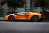
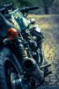

# My wallpapers

This is a repository containing wallpapers that I have gathered over the years. I have a python script that goes through the folder [wallpapers](/wallpapers) and makes thumbnails for each of the wallpapers in each of the folders and organizes them inside of the README.

---

<!-- THUMBNAILS_START -->

## abstract

[](wallpapers/abstract/ign_colorful.png)

## anime

[](wallpapers/anime/ilya_kuvshinov_06.jpeg)

## cars

[](wallpapers/cars/kevin-bhagat-3cLpiv8h5so-unsplash.jpg)

## city

[](wallpapers/city/evening-sky.png) [](wallpapers/city/ign_dudeOnBuilding3.png)

## fall

[](wallpapers/fall/0266.jpg)

## flag

[](wallpapers/flag/samuel-branch-ZPVisr0s_hQ-unsplash.jpg)

## halloween

[](wallpapers/halloween/ghfw94chrlt91.png) [](wallpapers/halloween/wp4767418.jpg)

## library

[](wallpapers/library/0166.jpg)

## mobile

[](wallpapers/mobile/121cff020cb2f670e7c56190b3b57f7b.jpg) [](wallpapers/mobile/aleks-marinkovic-rvziaOyz9_Y-unsplash.jpg)

## motorcycles

[](wallpapers/motorcycles/wp10762147-harley-davidson-dyna-wallpapers.jpg) [](wallpapers/motorcycles/wp10762149.jpg) [](wallpapers/motorcycles/wp6959117.jpg)

## nature

[](wallpapers/nature/forrest.png) [](wallpapers/nature/yosemite.png)

## space

[](wallpapers/space/2e3e68fb-b6da-4bb6-8ad3-9a2d335340af.png) [](wallpapers/space/astronaut-jellyfish-space-digital-art-uhdpaper.com-4K-107.jpg)

<!-- THUMBNAILS_END -->

---

## File Tree

<!-- BEGIN FILE TREE -->
```text
.
├── LICENSE
├── Pipfile
├── Pipfile.lock
├── README.md
├── file_tree.py
├── readme_thumbnails.py
├── .github
├── tests
├── thumbnails
├── wallpapers
.github
│   ├── workflows
```
<!-- END FILE TREE -->

## Python Scripts

- [readme_thumbnails.py](readme_thumbnails.py)
- [file_tree.py]

## Wallpaper Sources

Here are some of the links to places that I have gotten these wallpapers from.

- [WallpaperCave](https://wallpapercave.com/)
- [Unsplash](https://unsplash.com)
- [Aleks Marinkovic](https://unsplash.com/@aleks_marinkovic)

## Code Resources

- This code was written with the assistance of GPT-4.
- I give thanks to [@wdsrocha](https://github.com/wdsrocha) and his [wallpaper repository](https://github.com/wdsrocha/wallpapers) for inspiration in making this.
