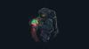

# My wallpapers

This is a repository containing wallpapers that I have gathered over the years. I have a python script that goes through the folder [wallpapers](/wallpapers) and makes thumbnails for each of the wallpapers in each of the folders and organizes them inside of the README. 

<!-- THUMBNAILS_START -->

## abstract

 

## anime

 

## city

  

## halloween

  

## motorcycles

 

## nature

  

## space

  

<!-- THUMBNAILS_END -->

## Wallpaper Sources 

Here are some of the links to places that I have gotten these wallpapers from. 

## Code Resources 

- This code was written with the assistance of GPT-4. 
- I give thanks to @wdsrocha and his [wallpaper repository](https://github.com/wdsrocha/wallpapers) for inspiration in making this. 
